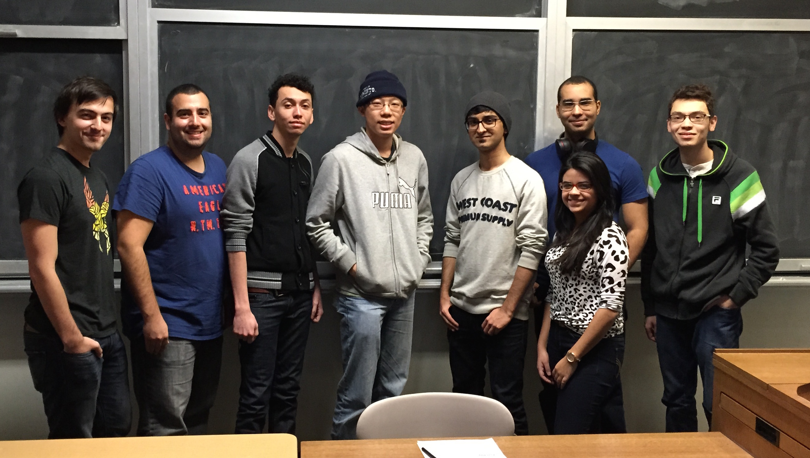

  

## Introduction

__Zhi Hao (David) Chen__ 
I am a 4th year CS student looking to finish at the end of the term.  I have some web programming experience from projects I have done for school.  In my spare time I enjoy playing all sorts of games with my friends, but recently I am trying to do some side projects for fun.

__Alexei Darmin__ 
I am a 4th year CS student aiming to graduate in 2016.  I've been a part-time Front-End web developer for two years and my goal is to either become a full stack web developer or to specialize in front-end once I graduate. My time is usually split between school, work, friends and sports. Primarily soccer for the UTSC team, ice skating, and table tennis.

__Eric Scott__ 
I am a 4th year CS student completing my final semester.  I took last year off to do a 16 month internship at IBM for the WebSphere Commerce team doing product support, tool development, client enablement, and client education. I currently work there part time during the school year, returning for full time work starting May 1st. In my spare time, I enjoy playing board games, hockey, and going snowboarding.  

__Lucas Lima__  
I am an international CS student. I have some experience in Web Development and I have written and collaborated on articles for IBM Developer Works ([Article 1](http://www.ibm.com/developerworks/cloud/library/cl-blograils-app/index.html), [Article 2](http://www.ibm.com/developerworks/data/library/techarticle/dm-1408-arduino-iot-app/index.html), [Article 3](http://www.ibm.com/developerworks/analytics/library/ba-muse-toycar-app/index.html)), having one of them in the [Top 15 Bluemix tutorials in 2014](http://www.ibm.com/developerworks/cloud/library/cl-bestoflbluemix2014/index.html). I have also presented in some Toronto SMAC meetups. In my spare time I like playing drums and occasionally engaging in some cool tech projects. 

__Haris Shoaib__ 
I am a 3rd year Computer Science Specialist, hoping to graduate in 2017. Currently, I am also a part-time Jr. Web developer student at OISE. At work, I help my supervisor in completing small, independent tasks, which also helps me learn about the basics of front and back end web development at a manageable pace. Although, at the moment my strengths lie in Front-end Web development, I hope to be proficient in working with the full stack. In my spare time, I like to read tech articles like those on HackerNews, play basketball, or go out with my friends. 

__Caroline Pessoa Caetano__ 
I am a fourth-year Computer Science student. I have participated in a research project in which I developed a website for the tourism observatory of Sao Paulo. Another interesting project consisted of the design of an educational game during IHC course. During the last summer I worked as Junior Software Developer at [Readyportal](http://www.readyportal.com/); one of the projects that I have worked on is available [here](http://wizardriodejaneiro.com.br/).

__Antonio Carlos Raposo__ 
I am a 3rd year Computer Science student. I have participated in a few projects of research back in brazil, one of them involving Big Data and in Toronto i had an intership at the Big Data University, During my intership my team developed an educational game using the Oculus rift technology in order to gather atention of the youth, you can see it [here](http://geovr.mybluemix.net/). One of my hobbies is to play card games like poker, magic the gathering and Hearthstone.

__Shudmanul Chowdhury__ 
I'm a 3rd year student pursuing a Specialist in Computer Science, expecting to graduate in 2017 with PEY, and currently working as a TA for CSC148. In the past, I have developed and deployed a couple of Android apps on the [Play Store](https://play.google.com/store/apps/developer?id=Seedform) and worked at [WSIB](http://www.wsib.on.ca/) as a student software developer. In my spare time, I enjoy developing mobile apps and playing games such as Payday 2 and Valkerye Chronicles. Due to time constraints however, I usually just end up playing Super Nintendo games on my phone during commute.
